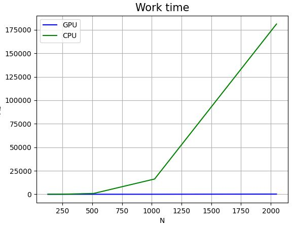
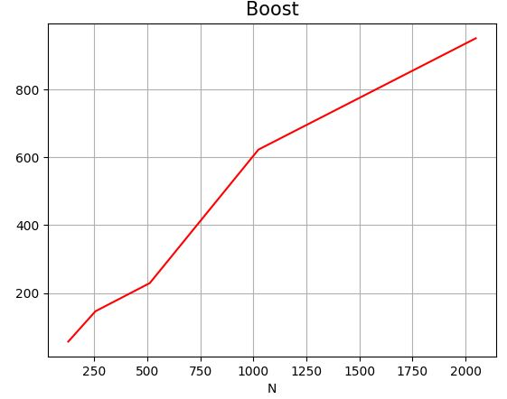

# Лабораторная работа №1 
### Задание
Перемножение матриц.  
Задача: реализовать алгоритм перемножения матриц  
Язык: C++ или Python  
Входные данные: 2 матрицы размером от 100х100 до 2000х2000 каждая  
Выходные данные: проверка корректности перемножения + время вычисления  

Реализация должна содержать 2 функции перемножения матриц: на CPU и на GPU с
применением CUDA.  

#### Описание программы
В программе происходит перемножение двух квадратных матриц размерности N×N, данные для заполнения которых сгенерированы случайным образом.
Пример работы:

#### Функции:
Filling_m, где случайность данных получается за счёт использования текущего системного времени.

matMulCPU производит последовательное вычисление произведения матриц на хосте.

equals_m проверяет что результирующие матрицы вычисленные на GPU и CPU совпадают.

matMulCuda функция ядра для перемножения матриц на девайсе. 

### Результаты
Ниже приведена таблица времени работы параллельной и последовательной функций для различных размерностей матрицы. Время указано в миллисекундах и получено как среднее по 5 запускам.

Размерность матриц, N | Время работы на GPU, мс | Время работы на CPU, мс | Ускорение
:----:|:-------:|:-----------:|------:
128 | 0,15 | 8,52 | 56,80
256 | 0,63| 92,13 | 146,23
512 | 3,83 | 878,00 | 229,24
1024 | 26,06 | 16234,77 | 622,97
2048 | 190.51 | 181225,90 | 951,26

### Визуализация таблицы.
##### График времени рассчёта произведения матриц

##### График ускорения

На основе полученных результатов можно сделать вывод, что время работы функции выполняющейся на GPU растёт очень медленно при увеличении размерности матрицы, чего нельзя сказать о функции перемножения на CPU. По графику ускорения видно, что программа на CUDA дает существенный выигрыш во времени при решении задачи по переемножению матриц. 
