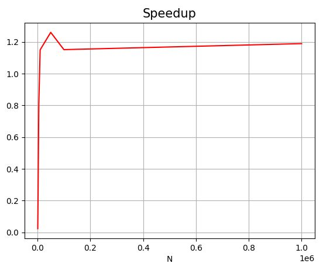

# Лабораторная работа №2 
### Задание
Задача: реализовать алгоритм сложения элементов вектора
Язык: C++ или Python
Входные данные: Вектор размером 1 000..1 000 000 значений.
Выходные данные: сумма элементов вектора + время вычисления
Реализация должна содержать 2 функции сложения элементов вектора: на CPU и на
GPU с применением CUDA.
 
#### Описание программы
Функция SumV отвечает за вычисление суммы элементов вектора на GPU. 
Для сохранения промежуточных результатов создан массив с разделяемой памятью sdate[]. 
Затем вычисляется номер нити и происходит получение частичной суммы путём суммирования элементов с индексом, равным индексу нити с последующим прибавление размерности блока, это позволяет использовать только один блок для вычислений. Чтобы избежать ошибок с доступом к данным, после данного цикла происходит синхронизирование нитей.
Далее по принципу редукции происходит суммирование полученных промежуточных сумм. Суммируются каждые две последовательно идущие ячейки, затем синхронизация, за следующий цикл суммируются результаты предыдущей итерации и т.д. Итоговый результат остаётся в sdate[0] и нулевым потоком записывается для вывода.

Функция CPU_SumV выполняет последовательное сложение элементов вектора.

### Результаты
Ниже приведена таблица времени работы параллельной и последовательной функций для различных размерностей векторов. Время указано в миллисекундах и получено как среднее по 5 запускам.

Размерность , N | Время работы на GPU, мс | Время работы на CPU, мс | Ускорение
:----:|:-------:|:-----------:|------:
1000 | 0,02871 | 0,0066 | 0,0229
5000 | 0,0298  | 0,0242 | 0,8090
10000 | 0,0372 | 0,0428 | 1,1505
50000 | 0,1372 | 0,1729 | 1,2609
100000 | 0,2501 | 0,2881 | 1,1519
1000000 | 2,0109 | 2,3921 | 1,1901

### Визуализация таблицы.
##### График времени рассчёта произведения матриц

##### График ускорения

На основе полученных результатов можно сделать вывод, что время работы функции выполняющейся на GPU растёт очень медленно при увеличении размерности матрицы, чего нельзя сказать о функции перемножения на CPU. По графику ускорения видно, что программа на CUDA дает существенный выигрыш во времени при решении задачи по переемножению матриц. 
