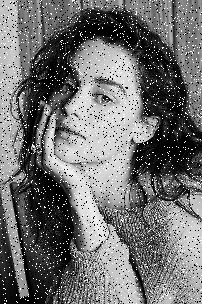

# Лабораторная работа №4
### Задание
Median filter

Построить 9-точечный медианный фильтр, применить его к изображению размера M×N с шумом "Соль и перец" и сохранить результат в виде конечного изображения.

Пропущенные значения для краевых строк и столбцов должны быть взяты из ближайших пикселей.

Реализация CUDA должна использовать текстурную память.
### Входные данные
Изображение в оттенках серого в формате BMP.
### Выходные данные
Время обработки изображения с использованием графического процессора.

Время обработки изображения с использованием центрального процессора.

Результирующие изображения в формате BMP.

### Описание программы

Лабораторная была написана с помощью Google Colab

#### Функции:
noise_sp - метод для создания шума "Соль и перец" на изображении.

SAP - последовательная реализация медианного фильтра.

Sort_m - производит сортировку массива.

kernel - функция ядра реализующая медианный фильтр.

### Результаты
Ниже приведена таблица времени работы параллельной и последовательной функций для изображений разного размера. Время указано в секундах.

Размерность изображений, N | Время работы на GPU, с | Время работы на CPU, с | Ускорение
:----:|:-------:|:-----------:|------:
400×600| 0.00469 | 1.24325 | 265.08528
600×800 | 0.00624 | 2.56341 | 410.80288
1000×1200 | 0.00878 | 6.45367 | 735.04214

### Результаты работы на примере

#### Оригинальное изображение

#### Изображение с добавлением шума

#### Обработанное изображение (CPU)

#### Обработанное изображение (GPU)

Анализируя полученные ускорения, можно сделать вывод, что использование распараллеливания для решения данной задачи многократно ускоряет работу программы. Особенно для больших изображений.
